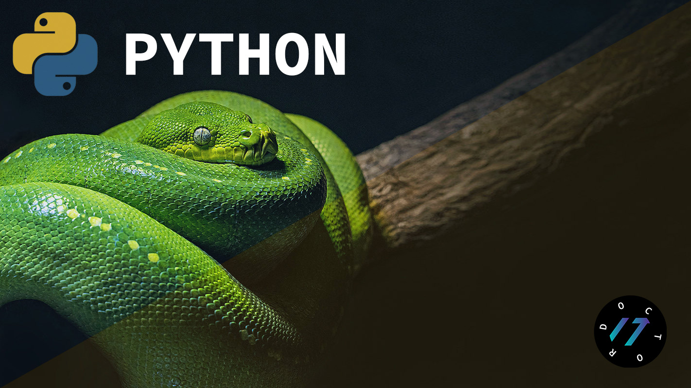
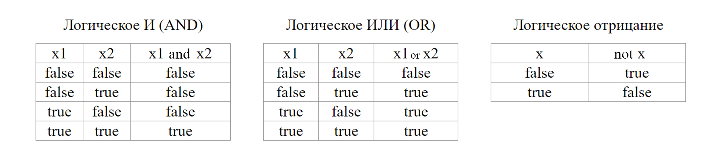
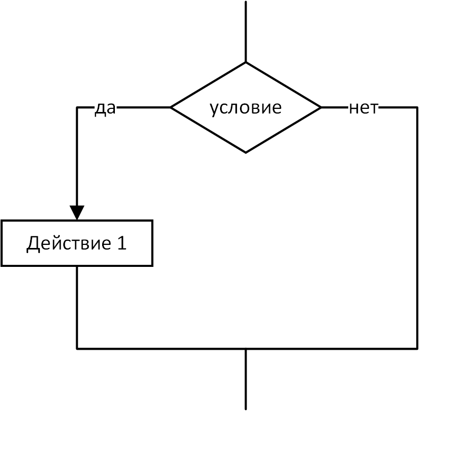
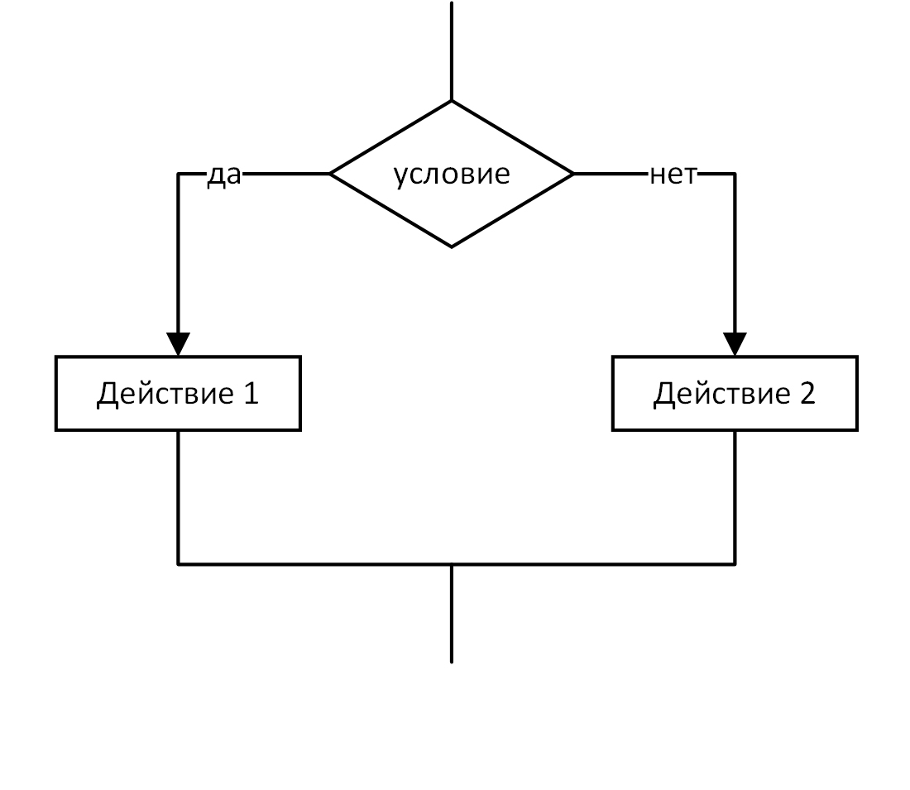
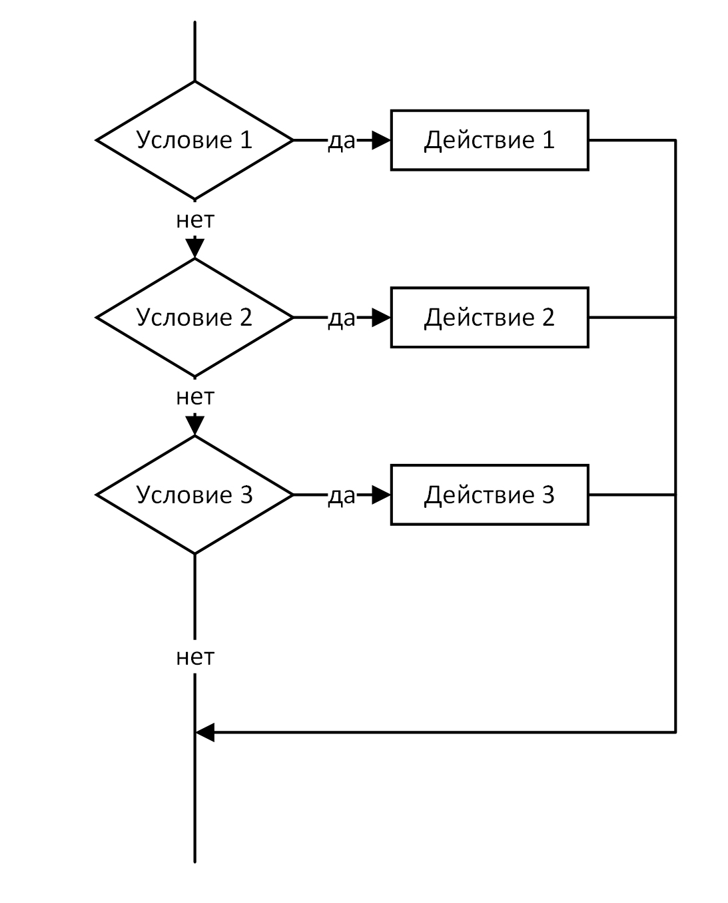
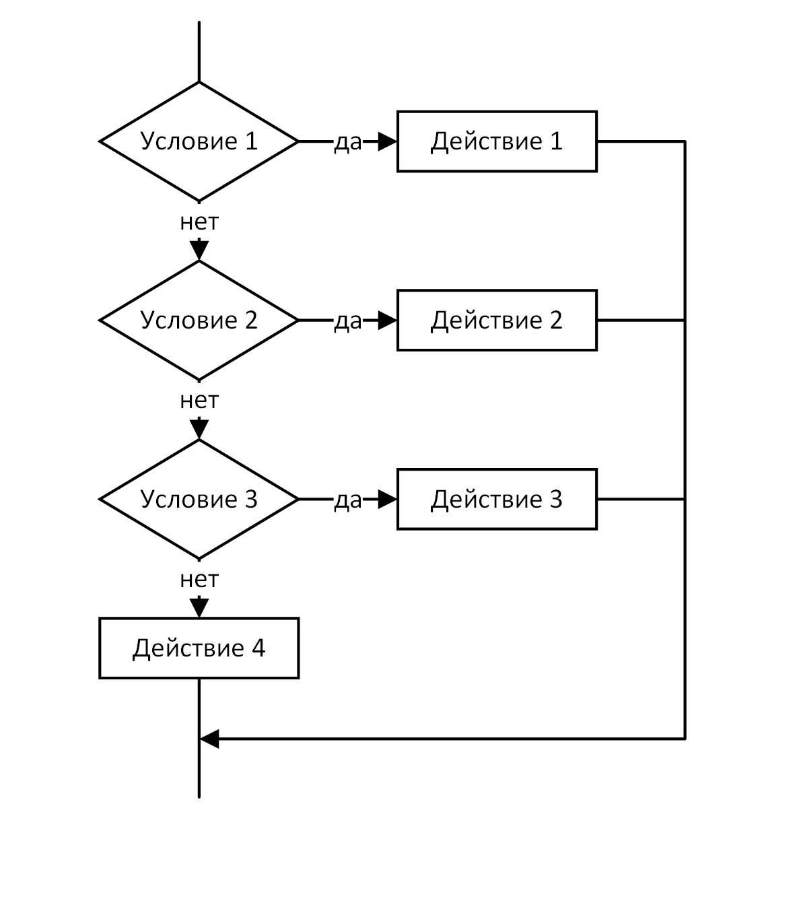
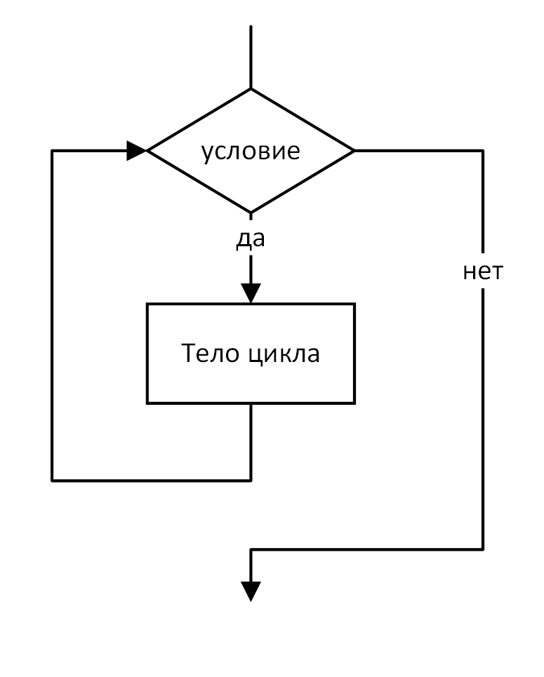
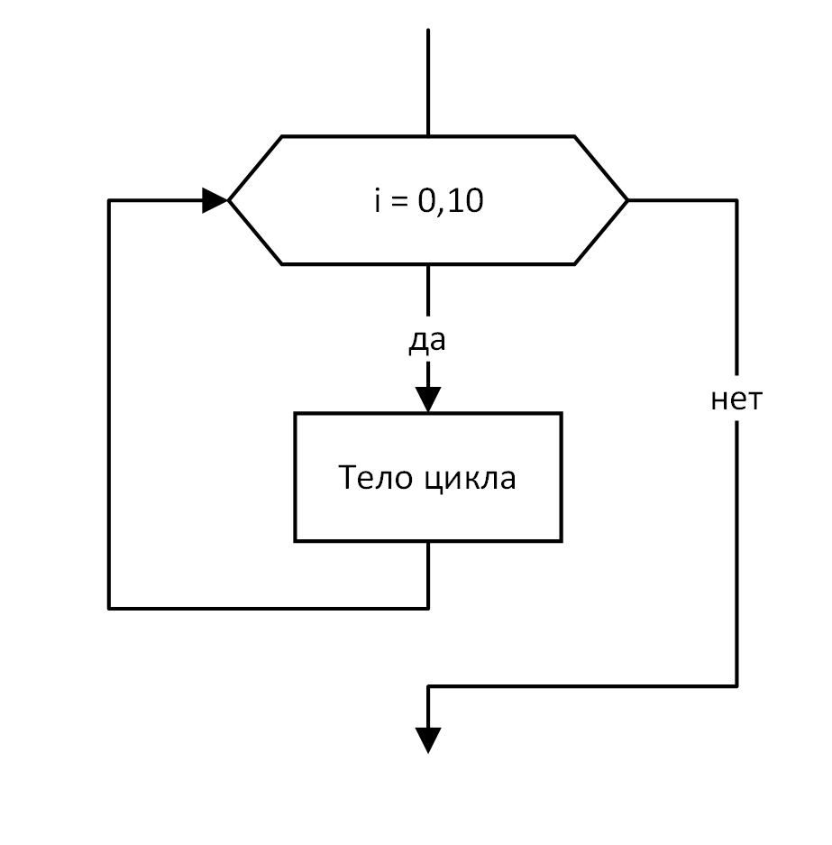
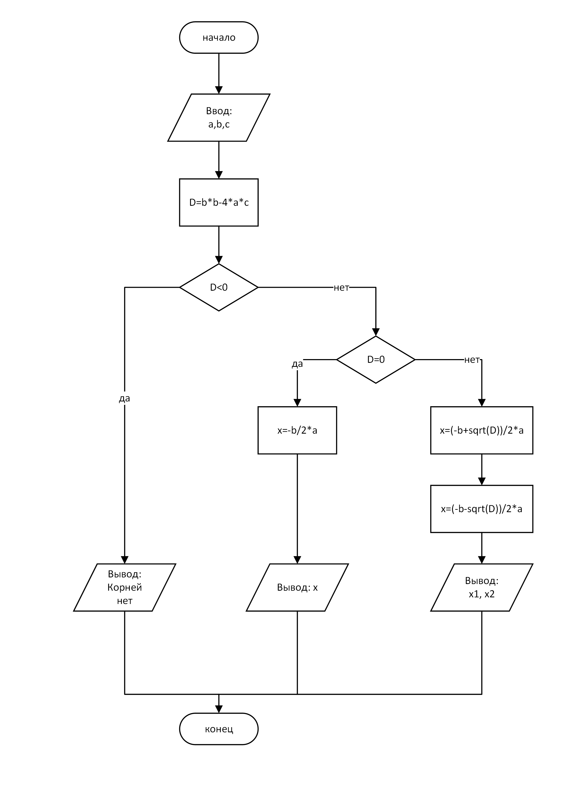

# Шпаргалка по Python от ITDoctor

### Перейти к видео (клик по изображению)

### 1. Установка
Начало работы с языком Python. Установка и проверка версии интерпретатора. Команды для терминала, написагте первой программы Hello World в IDLE, Terminal и VS Code. Расширения для работы с Python в редаткоре VS Code.
> Файл с кодом: [lesson01.py](lesson01.py)
### 2. Строки
Как устроены строки на языке Python. Разные виды кавычек и способы экранирования кавычек для их отображения. Вывод текста на экран. Создание первой переменной.
> Файл с кодом: [lesson02.py](lesson02.py)
### 3. Арифметика
Рассматриваем арифметические операторы. Способы возведения в степень и извлечение квадратного корня. Сокращения для операторов. Побитовые операторы.
> Файл с кодом: [lesson03.py](lesson03.py)
### 4. Логика
Рассмотрим операторы сравнения на Python. Логический тип данных bolean и его значения True и False. Синтаксис условных конструкций if elif else.
#### Логические операции

#### Блок схемы для условных конструкций
<table>
  <tr>
    <td></td>
    <td></td>
  </tr>
  <tr>
    <td></td>
    <td></td>
  </tr>
</table>

> Файл с кодом: [lesson04.py](lesson04.py)
### 5. Циклы
Рассмотрим синтаксис циклов на язык Python. Цикл while и цикл for могут иметь блок else. Так же рассмотрим примеры с break и continue.
#### Блок схемы для циклов while (слева) и for (справа)
<table>
  <tr>
    <td></td>
    <td></td>
  </tr>
</table>

> Файл с кодом: [lesson05.py](lesson05.py)
### 6. Последовательности
Последовательности - это списки, строки и кортежи. Рассмотрим на примерах как с ними работать.
> Файл с кодом: [lesson06.py](lesson06.py)
### 7. Вырезка
Из последовательностей можно получать вырезку. Фрагмет строки, кортежа или списка. Для этого используется специальный синтаксис с квадратными скобками.
> Файл с кодом: [lesson07.py](lesson07.py)
### 8. Множества
Работа с множествами. Функции и возможности множеств.
> Файл с кодом: [lesson08.py](lesson08.py)
### 9. Словари
Работа с словарями. Удаление и добавление элементов. Обход в цикле. Проверка на вхождение элемента в словарь и многое другое.
> Файл с кодом: [lesson09.py](lesson09.py)
### 10. Функции
Создание своих функций на Python. Функции с параметрами. Установка значения параметра по умолчанию. Возвращаемые значения функции и возможность возвращать несколько значений из функции. А так же функции exec и eval.
> Файл с кодом: [lesson10.py](lesson10.py)
### 11. Модули
Любой файл с расширением .py является модулем и его можно импортировать в другой файл для того чтобы использовать функции из этого модуля. Рассмотрим способы импорта модулей.
> Файл с кодом: [lesson11.py](lesson11.py)
### 12. Классы
Классы на языке Python. Создание классов, объявление методов и создание конструктора класса.
> Файл с кодом: [lesson12.py](lesson12.py)
### 13. Работа с файлами
Рассмотрим как можно открывать файл для чтения или записи. Запись в файл. Чтение из файла в цикле по строкам.
> Файл с кодом: [lesson13.py](lesson13.py)
### 14. Квадратное уравнение
В этом примере мы решим задачу по поиску корней квадратного уравнения. Алгоритм очень прост и интересен. И вы наверняка знаете его из школы. Будем получать значения коэффициентов a, b и с от пользователя.
#### Алгоритм поиска корней квадратного уравнения

> Файл с кодом: [lesson14.py](lesson14.py)
### 15. Сортировка выбором - Модуль
Создание своего модуля с функцией сортировки массива выбором.
> Файл с кодом модуля: [lesson15.py](lesson15.py)
### 16. Быстрая сортировка - Модуль
Создание своего модуля с функцией быстрой сортировки массива.
> Файл с кодом модуля: [lesson16.py](lesson16.py)
### 17. Бинарный поиск - Импорт модулей
В этом примере мы решим задачу поиска элемента в массиве. Будем использовать алгоритм бинарного поиска. Для этого алгоритма важно, чтобы входной массив был отсортирован. Для этого мы импортируем один из модулей с сортировкой массива, который мы писали ранее и решаем задачу.
> Файл с кодом: [lesson17.py](lesson17.py)

### Шпаргалка (кликабельная)

### Ссылки на полезные видео уроки:
1. <a href="https://youtu.be/2yT8jMgWvko" target="_blank">Основы программирования на примере Java Script</a>
2. <a href="https://youtu.be/4rkj2CUpzpE" target="_blank">ООП на Java Script</a>
3. <a href="https://youtu.be/LJCfPmbU4sc" target="_blank">ООП на PHP</a>
3. <a href="https://youtu.be/daJgnaNC_1U" target="_blank">Квадратное уравнение на Java Script</a>
3. <a href="https://youtu.be/uY0I4c3nwfA" target="_blank">Блок-схемы алгоритмов</a>

### Литература (онлайн PDF):
1. <a href="https://wombat.org.ua/AByteOfPython/AByteofPythonRussian-2.02.pdf" target="_blank">A Byte of Python - Swaroop Chitlur</a>
2. <a href="https://kitobz.com/upload/%D0%93%D1%80%D0%BE%D0%BA%D0%B0%D0%B5%D0%BC%20%D0%B0%D0%BB%D0%B3%D0%BE%D1%80%D0%B8%D1%82%D0%BC%D1%8B-%20%20www.kitobz.com.pdf" target="_blank">Грокаем алгоритмы - Адитья Бхаргава</a>
3. <a href="https://dfedorov.spb.ru/python3/book.pdf" target="_blank">Основы программирования на примере языка Python - Д. Ю. Федоров</a>
4. <a href="http://uchcom7.botik.ru/L/prog/python/python_01.pdf" target="_blank">Изучаем Python - Mark Lutz</a>

---

